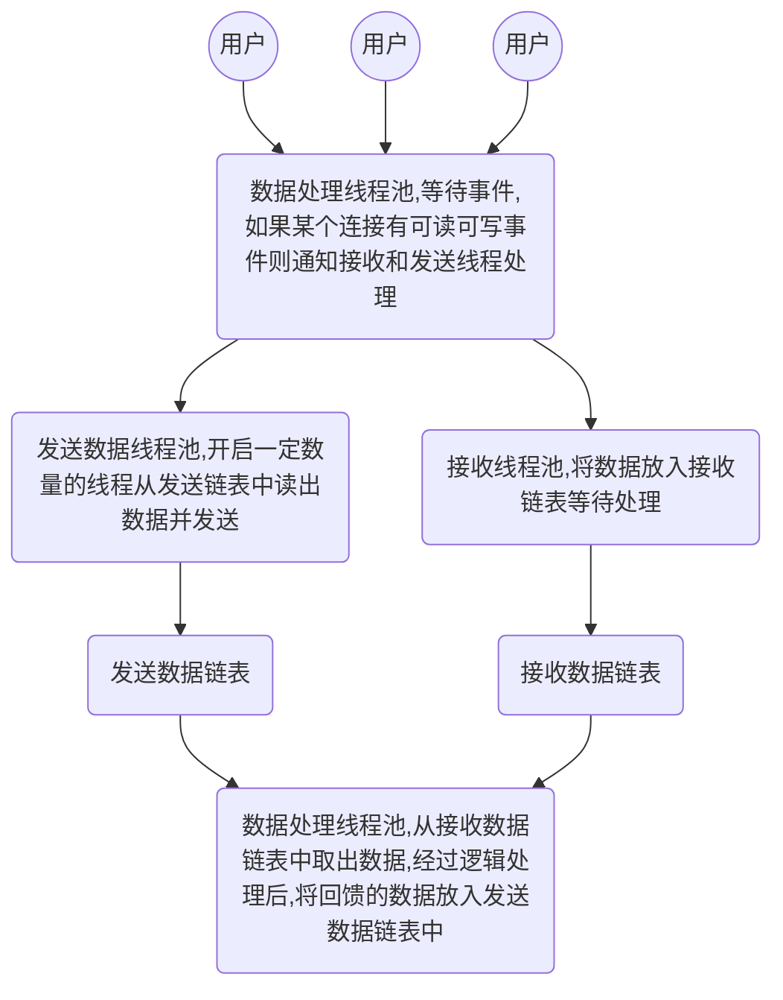

###  epllo 学习
> 基本思路

> epoll反应堆解答
- 反应堆的流程：

监听可读事件(ET) ⇒ 数据到来 ⇒ 触发事件 ⇒ epoll_wait()返回 ⇒
读取完数据(可读事件回调函数内) ⇒ 将该节点从红黑树上摘下(可读事件回调函数内) ⇒ 设置可写事件和对应可写回调函数(可读事件回调函数内) ⇒ 挂上树(可读事件回调函数内) ⇒ 处理数据(可读事件回调函数内)

⇒ 监听可写事件(ET) ⇒ 对方可读 ⇒ 触发事件 ⇒ epoll_wait()返回 ⇒
写完数据(可写事件回调函数内) ⇒ 将该节点从红黑树上摘下(可写事件回调函数内) ⇒ 设置可读事件和对应可读回调函数(可写读事件回调函数内) ⇒ 挂上树(可写事件回调函数内) ⇒ 处理收尾工作(可写事件回调函数内) ⇒ 直到程序停止前一直这么交替循环 

- 解释
1. 为什么要可读以后设置可写，然后一直交替？
答：服务器的基本工作无非数据的收发，epoll反应堆模型准从TCP模式，一问一答。服务器收到了数据，再给与回复，是目前绝大多数服务器的情况。 
2. 如此频繁的增加删除不是浪费CPU资源吗？
答：对于同一个socket而言，完成收发至少占用两个树上的位置。而交替只需要一个。任何一种设计方式都会有浪费CPU资源的时候，关键看你浪费得值不值，此处的耗费能否换来更大的收益才是衡量是否浪费的标准。和第二个问题综合来看，这里不算浪费
3. 设置读写交替的好处
3.1 服务器接收到客户端数据，刚好此时客户端的接收滑动窗口满，我们假设不进行可写事件设置，并且客户端是有意让自己的接收滑动窗口满的情况(黑客)。那么，当前服务器将随客户端的状态一直阻塞在可写事件，除非你自己在写数据时设置非阻塞+错误处理 
3.2 客户端在发送完数据后突然由于异常原因停止，这将导致一个FIN发送至服务器，如果服务器不设置可写事件监听，那么在接收数据后写入数据会引发异常SIGPIPE，最终服务器进程终止。