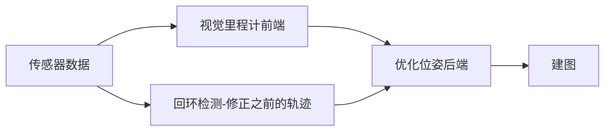
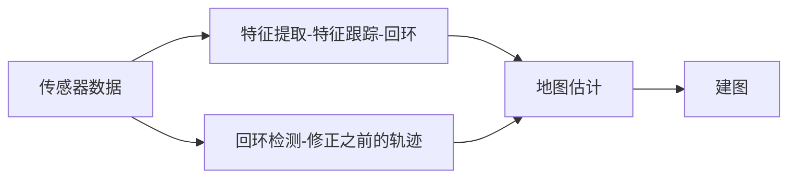

# SLAM(同时地图构建与定位)

> SLAM定义

- SLAM 指的是当某种移动设备（如机器人/无人机 手机 汽车等）
- 从一个未知的环境里的未知地点出发
- 在运动的过程中通过传感器（如激光雷达 摄像头等）观测定位自身的位置 姿态 运动轨迹
- 再根据自身位置进行增量式的地图构建
- 从而达到同时定位和地图构建的目的

>SLAM的作用

- 有了地图APP, 为何还需要使用SLAM
- 原因1： 民用的GPS精度不高
- 原因2： GPS有限制（隧道丢失信号）

>SLAM技术框架(一个典型的SLAM系统)

- 视觉里程计
	根据图像定量估算帧间相机的运动
- 后端优化
	优化前端计算的位姿，减少漂移
- 建图
	2D/3D，稀疏/半稀疏/稠密
- 回环检测
	认识自己曾经去过的地方，消除累计误差
	

> SLAM传感器
- 激光（精度高，帧率小，计算量小，研究充分，体积大功耗大，价格昂贵，信息量有限）
- 视觉（单目，双目，RGB-D相机，全景相机， 便宜，体积小，信息丰富，计算量大，易受干扰）

> 视觉传感器对比
- 单目（成本低，距离不受限，尺度不确定性大，初始化问题，依赖纹理光照）
- 双目（被动算深度，距离不受限，配置复杂，计算量大，依赖纹理光照）
- RGB-D（主动测深度，高帧率高精度，量程受限，不适合室外，受材质干扰）

> SLAM优秀开源方案
> 稀疏地图 ORB SLAMv2 https://github.com/raulmur/ORB_SLAM2
> 半稠密地图
	LSD SLAM(单双目，RGB-D) https://github.com/tum-vision/isd_slam
	DSO(单目) https://github.com/JakobEngel/dso
> 稠密地图
	Elastic Fusion(RGB-D) https://github.com/mp3guy/ElasticFusion
	Bundle Fusion(RGB-D) https://github.com/niessner/BundleFusion
	infiniTAM v3(RGB-D) https://github.com/victorprad/InfiniTAM
> 多传感器融合
	VINS-Fusion(单双目+IMU) https://github.com/HKUST-Aerial-Robotics/VINS-Fusion
	OKVIS(单双木+IMU) https://github.com/ethz-asl/okvis
	Cartographer(LIDAR+IMU)https://github.com/googlecartographer/cartographer

>学习SLAM如何入门
- SLAM14讲
